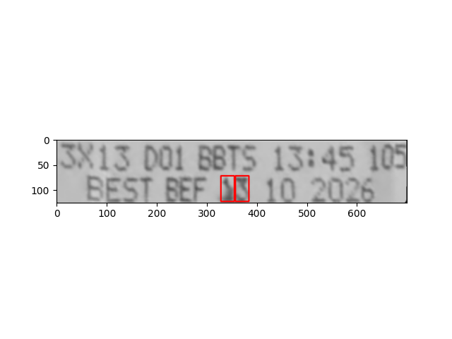
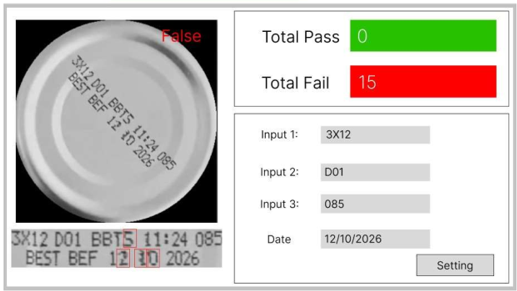

---

## 🕵️ Fault Detection on Date Code (Can Inspection System)

This project implements a **real-time fault detection system for date codes printed on cans**, fully developed using **classical image processing techniques** (no deep learning). I participated in this project as a **technical supporter** for an industrial customer.

The system analyzes each can image, isolates the printed date code area, applies OCR via image preprocessing, and compares the extracted text with expected input fields to automatically classify the result as **Pass** or **Fail**.

### Industrial Workflow

```python
Algorithm: Verify Date Code on Can Image Using OCR

Input:
    - Live or stored image of a can
Output:
    - OCR-extracted text
    - PASS/FAIL status
    - Visual display and logging outcome

Steps:

1. Capture Image
    image ← capture_can_image()

2. Extract Region of Interest (ROI)
    roi ← extract_date_code_region(image)

3. Preprocess Image for OCR
    preprocessed ← preprocess_for_ocr(roi)

4. Perform OCR
    text ← perform_ocr(preprocessed)

5. Define Expected Fields
    expected ← {
        "Input1": "3X12",
        "Input2": "D01",
        "Input3": "085",
        "Date":   "12/10/2026"
    }

6. Validate OCR Output
    status ← "PASS" if all expected values ∈ text
           ← "FAIL" otherwise

7. Display Result
    display_result(image, text, status)

8. Log Status to Database
    log_to_database(status)

End Algorithm

```

### Industrial Application

* **Used in:** Food & Beverage packaging quality control
* **Tech stack:** OpenCV, Tesseract OCR, Python GUI (e.g., PyQt or Tkinter)
* **Automation goal:** Reject cans with incorrect or unreadable date codes
* **Key feature:** Fully image-processing-based (no machine learning required)
* **Outputs:** Visual GUI with Pass/Fail display, counters, and system logging

## 🚀 How to Run the Project

This project provides a system to detect **faults in date code printing** on cans using image processing techniques. You can run either the demo versions for specific fault types or launch the full UI-based application.

### Demo: Run Individual Fault Detectors

To test specific fault types (blurry numbers):

* `blurry_text_so2.py` – detects **faulty number "2"**
* `blurry_text_so3.py` – detects **faulty number "3"**
* `blurry_text_so5.py` – detects **faulty number "5"**

**Instructions:**

1. Open one of the scripts above.
2. **Edit the image path** inside the script to point to the correct test image, for example:

   ```python
   image = cv.imread("images/so2ro.png")
   ...
   image = cv.imread("images/so2mo.png")
   ```
3. Run the script:

   ```bash
   python blurry_text_so2.py
   ```

### Full Software UI (Integrated System)

To run the full software interface with image, OCR, pass/fail logic, and GUI overlay:

* Run:

  ```bash
  python testOnVideo.py
  ```

**Make sure to edit the video path** in the script if needed:

```python
video_path = "VideoOCR3.mp4"  # Or your custom video path
```

### Requirements

Install the dependencies using pip:

```bash
pip install opencv-python pytesseract numpy
```
---
### Here you can take a look of the example output: 

### The full software: 

